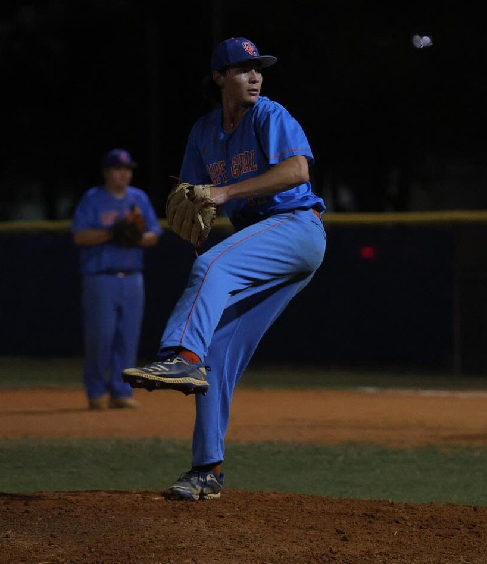

{width=300px}

I am a student at **New College of Florida (NCF)**, pursuing my Area of Concentration (AOC) in **Finance**.

Beyond the classroom, I am a pitcher for the **Mighty Banyans** baseball team. My time on the mound has given me a firsthand appreciation for the thin margins between success and failure in baseball. I know that a 1-0 count feels very different from a 0-1 count, not just for the fan watching, but for the athlete executing the pitch.

 

### The Project
This website was developed as part of my **Independent Study Project (ISP)** in Data Science and Analytics.

The goal of this ISP was to bridge the gap between my athletic experience and technical analysis. I wanted to learn how to take raw data of rows and columns of pitch logs, and translate them into visual narratives that explain *why* the game happens the way it does.

 

### The Intersection of Finance & Baseball
While my primary focus is Finance, the principles of data science apply universally. Whether analyzing financial markets or pitching metrics, the core challenge is the same: finding value and efficiency in large datasets.

This project represents the convergence of those interests—using the tools of data science to quantify the game I play every day.

